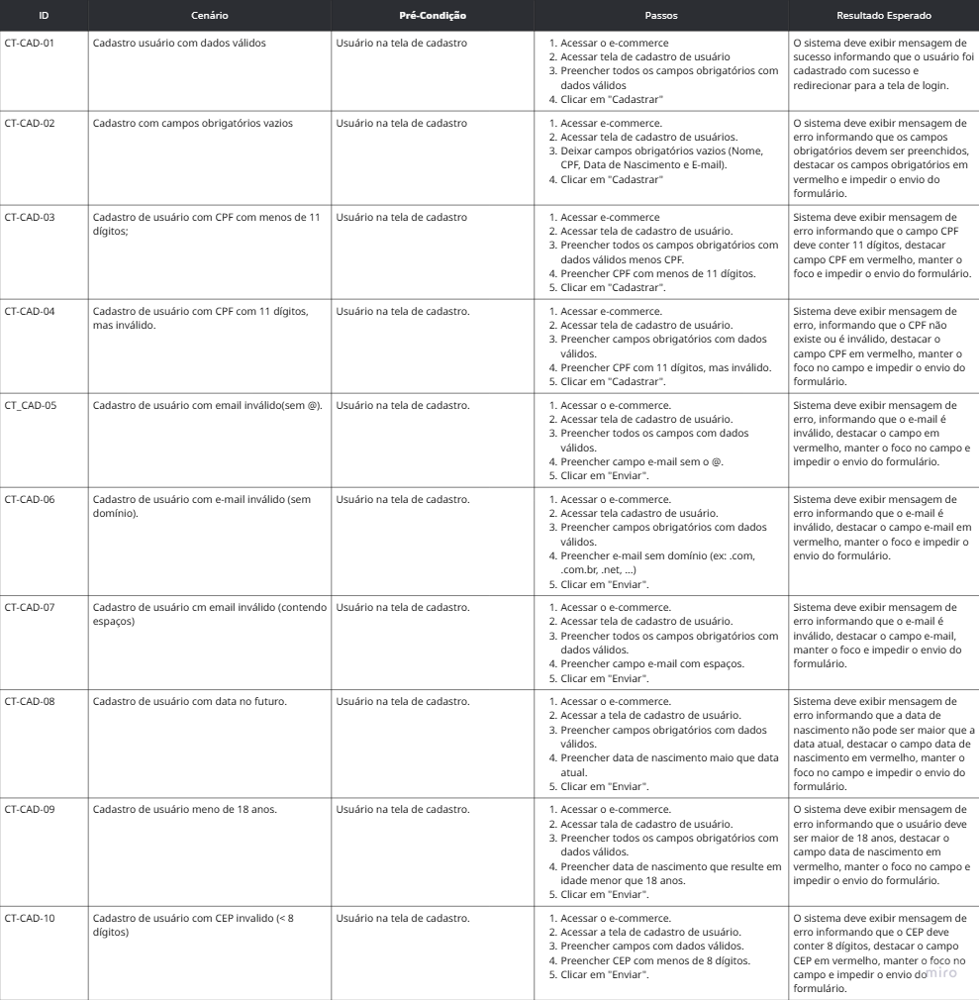
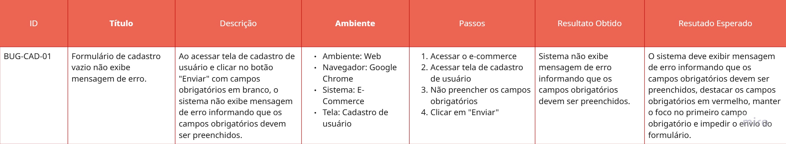
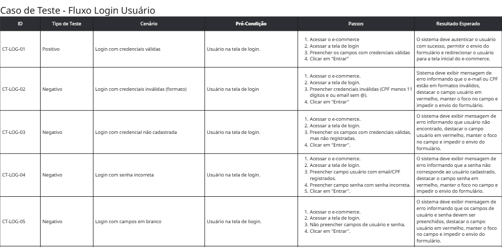

# Escopo do Teste
##  🚀 Objetivo do projeto
Validar a qualidade funcional de um e-commerce fictício, por meio da criação de cenários de teste, casos de teste, teste exploratórios e bugs, simulando a atuação de um Analista de Testes Jr.

## Fluxos do Escopo
* Cadastro de usuários.
* Login.
* Perfil do usuário.
* Carrinho de compras.
* Checkout(finalização de compra)

## Fora do Escopo
* integração com meios de pagamentos reais
* Teste de performance e segurança

### ➡️ Ações do Fluxo de Cadastro
* Preencher dados do formulário.
* Submeter o formulário de cadastro.
* Visualizar mensagem de erro de validação.
* Visualizar mensagem de sucesso após cadastro.
* Navegar para a tela de login.

### 📃 Lista de cenários
* Cadastro com dados válidos.[ x ]
* Cadastro com campos obrigatórios em branco.[ X ]
* Cadastro com CPF inválido.[ x ]
* Cadastro com e-mail inválido.[ x ]
* Cadastro com data de nascimento inválido.[ x ]
* Cadastro com usuário menor de 18 anos.[ x ]
* Cadastro com CEP inválido.[ x ]

## 📊 Matriz de Casos de Teste — Cadastro

## 🐞 Bug Report — Cadastro

### ➡️ Ações do Fluxo de Login
* Preencher dados do formulário.
* Submeter o formulário de login.
* Visualizar mensagens de erros de validação.
* Visualizar mensagem de sucesso após login.

### 📃 Lista de Cenários
* Login com credenciais válidas.[ x ]
* Login com E-mail inválido.
* Login com e-mail não cadastrado.
* Login com CPF inválido.
* Login com CPF não cadastrado.
* Login com senha incorreta.
* Login com campos em branco.

## 📊 Matriz de Casos de Teste — Login
